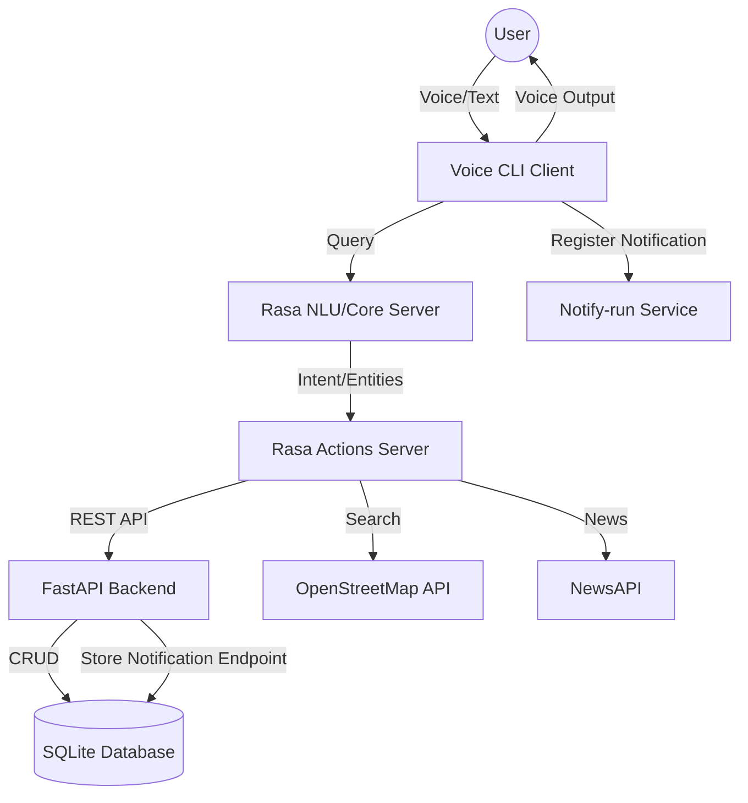

# Unified Healthcare Interface (UHI)

Unified Healthcare Interface (UHI) is a comprehensive healthcare management system designed to provide users with a centralized platform for managing their medical information. The system integrates a FastAPI backend, a Rasa-powered virtual assistant, and a voice-enabled CLI client to offer a seamless and intuitive user experience.

## System Architecture

The UHI ecosystem consists of three main components:

1.  **Backend**: A FastAPI server that manages the core data and provides a RESTful API for information retrieval and storage.
2.  **Virtual Assistant**: A Rasa-based conversational agent that processes natural language queries and executes custom actions to interact with the backend.
3.  **Client**: A voice-controlled CLI application that serves as the primary interface for the user, utilizing speech-to-text and text-to-speech technologies.



## Key Features

- **Personal Health Records**: Manage allergies, vaccinations, and basic health metrics (age, blood group, etc.).
- **Medical Management**: Keep track of prescriptions, doctor notes, and appointments.
- **Financial Tracking**: Monitor medical bills and payment status.
- **Emergency Support**: Register emergency contacts and trigger notifications.
- **Virtual Assistant**: Interact with the system using natural language for any queries or data entry.
- **Voice Interface**: Hands-free operation using speech recognition and synthesis.
- **Nearby Services**: Locate nearby medical amenities like hospitals or pharmacies using OpenStreetMap data.
- **Health News**: Stay updated with the latest health-related news headlines.

## Project Structure

```text
Unified-Healthcare-Interface/
├── Backend/                # FastAPI Backend
│   └── Server/
│       └── app/            # Application logic (API, CRUD, Models, Schemas)
├── Client/                 # Voice CLI Client
└── Virtual-Assistant/      # Rasa Virtual Assistant
    └── Virtual-Assistant/
        ├── actions/        # Custom Rasa actions for Backend integration
        ├── data/           # NLU, Stories, and Rules data
        └── tests/          # Rasa test stories
```

## Component Details

### Backend (FastAPI)

The backend is built with FastAPI and uses SQLAlchemy as the ORM with a SQLite database. It provides endpoints for managing various healthcare entities.

- **Models**: Defines the database schema for Users, Allergies, Appointments, Bills, Doctor Notes, Emergency Contacts, Prescriptions, and Vaccinations.
- **API Endpoints**: RESTful routes for CRUD operations on all models.
- **Database**: SQLite is used for simplicity and ease of setup.

### Virtual Assistant (Rasa)

The virtual assistant leverages Rasa for Natural Language Understanding (NLU) and dialogue management.

- **Actions**: Custom Python actions that perform API calls to the FastAPI backend or external services (NewsAPI, OpenStreetMap).
- **NLU Data**: Training data for intent recognition and entity extraction across multiple healthcare domains.
- **Stories/Rules**: Define the conversation flow and handling of specific user requests.

### Client (Voice CLI)

The client is a Python application that provides a voice-first interface.

- **Speech Recognition**: Uses the `speech_recognition` library to convert user voice input to text.
- **Text-to-Speech**: Uses `pyttsx3` to provide audible feedback to the user.
- **Interaction**: Forwards processed queries to the Rasa server and displays/speaks the results.
- **Setup**: Handles initial user registration and onboarding.

## Setup and Installation

### Prerequisites

- Python 3.9+
- Rasa
- FastAPI
- Uvicorn
- NewsAPI Key (for news features)

### Backend Setup

1.  Navigate to `Backend/Server`.
2.  Install dependencies (ensure a virtual environment is active).
3.  Start the server:
    ```bash
    ./start.sh
    ```

### Virtual Assistant Setup

1.  Navigate to `Virtual-Assistant/Virtual-Assistant`.
2.  Install dependencies.
3.  Train the Rasa model:
    ```bash
    rasa train
    ```
4.  Start the actions server:
    ```bash
    ./start_actions_server.sh
    ```
5.  Start the Rasa server:
    ```bash
    ./start_rasa_server.sh
    ```

### Client Setup

1.  Navigate to `Client`.
2.  Install dependencies.
3.  Configure environment variables (API URLs, etc.) in a `.env` file.
4.  Run the client:
    ```bash
    ./start.sh
    ```

## External Integrations

- **OpenStreetMap (Nominatim)**: Used for searching nearby medical amenities.
- **NewsAPI**: Used for fetching the latest health news.
- **Notify-run**: Used for registration and delivery of push notifications.
